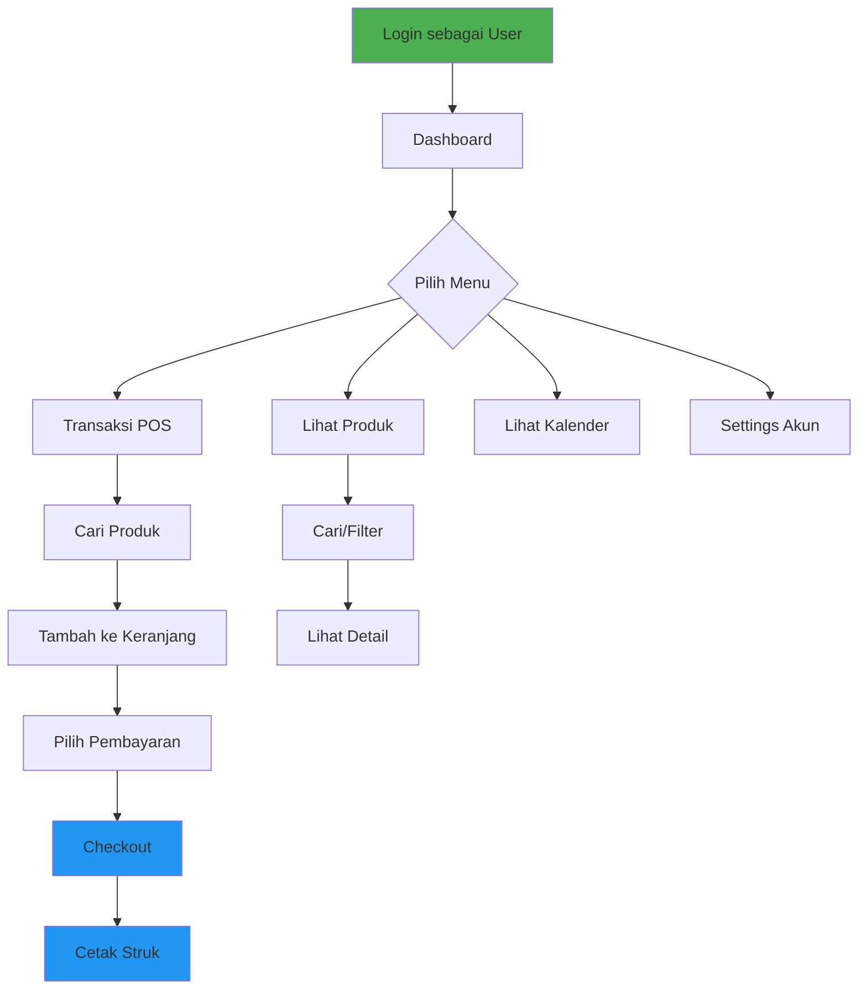
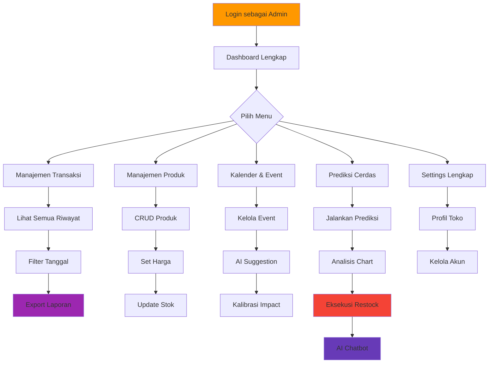

# Analisis Kebutuhan Role-Based Access Control (RBAC) SIPREMS

Dokumen ini menganalisis proses bisnis dan kebutuhan akses untuk sistem **2 Level Role** (User & Admin) pada aplikasi SIPREMS POS.

---

## Ringkasan Eksekutif

SIPREMS adalah aplikasi **Point of Sale (POS) dan Manajemen Inventori** yang ditargetkan untuk UMKM. Analisis ini mendefinisikan pembagian hak akses antara **User (Kasir)** dan **Admin (Pemilik Toko)** berdasarkan prinsip **Least Privilege** dan **Separation of Concerns**.

---

## Definisi Role

| Role | Persona | Tanggung Jawab Utama |
|------|---------|---------------------|
| **User (Kasir)** | Staff toko yang bertugas di counter | Operasional penjualan harian, layanan pelanggan |
| **Admin (Pemilik/Manager)** | Pemilik UMKM atau manajer toko | Manajemen bisnis, pengambilan keputusan, kontrol inventori |

---

## Matriks Hak Akses per Modul

### 1. Dashboard (`/dashboard`)

| Fitur | User | Admin | Keterangan |
|-------|:----:|:-----:|------------|
| Lihat Metrik Penjualan (hari ini) | ✅ | ✅ | User perlu tahu target harian |
| Lihat Metrik Penjualan (mingguan/bulanan/tahunan) | ❌ | ✅ | Data strategis untuk pemilik |
| Lihat Chart Trend Penjualan | ❌ | ✅ | Analitik bisnis |
| Lihat Top Produk | ✅ | ✅ | Membantu rekomendasi ke pelanggan |
| Lihat Produk Stok Rendah | ✅ | ✅ | Awareness untuk operasional |

---

### 2. Transaksi (`/transaction`)

| Fitur | User | Admin | Keterangan |
|-------|:----:|:-----:|------------|
| **POS View** ||||
| Buat Transaksi Baru | ✅ | ✅ | Core function kasir |
| Cari Produk | ✅ | ✅ | Operasional |
| Filter Kategori | ✅ | ✅ | Operasional |
| Atur Metode Pembayaran | ✅ | ✅ | Operasional |
| Atur Tipe Order (Dine-in/Takeaway) | ✅ | ✅ | Operasional |
| **History View** ||||
| Lihat Riwayat Transaksi (hari ini) | ✅ | ✅ | Verifikasi transaksi sendiri |
| Lihat Riwayat Transaksi (semua) | ❌ | ✅ | Audit dan laporan |
| Filter Berdasarkan Tanggal | ❌ | ✅ | Analitik |
| Export ke Excel | ❌ | ✅ | Pembukuan/Akuntansi |
| Export ke PDF | ❌ | ✅ | Laporan |
| Cetak Struk | ✅ | ✅ | Pelayanan pelanggan |
| Void/Batalkan Transaksi | ❌ | ✅ | Keputusan keuangan |

---

### 3. Produk (`/products`)

| Fitur | User | Admin | Keterangan |
|-------|:----:|:-----:|------------|
| Lihat Daftar Produk | ✅ | ✅ | Operasional |
| Cari Produk | ✅ | ✅ | Operasional |
| Filter Kategori | ✅ | ✅ | Operasional |
| Lihat Detail Produk | ✅ | ✅ | Informasi pelanggan |
| **Tambah Produk Baru** | ❌ | ✅ | Keputusan bisnis |
| **Edit Produk** | ❌ | ✅ | Keputusan bisnis |
| **Hapus Produk** | ❌ | ✅ | Keputusan bisnis (high risk) |
| **Update Stok Manual** | ❌ | ✅ | Kontrol inventori |
| **Set Harga Jual/Modal** | ❌ | ✅ | Keputusan finansial |
| Upload Gambar Produk | ❌ | ✅ | Manajemen konten |

---

### 4. Kalender Event (`/calendar`)

| Fitur | User | Admin | Keterangan |
|-------|:----:|:-----:|------------|
| Lihat Kalender & Event | ✅ | ✅ | Awareness jadwal |
| Lihat Hari Libur Nasional | ✅ | ✅ | Informasi |
| **Tambah Event Baru** | ❌ | ✅ | Perencanaan bisnis |
| **Edit Event** | ❌ | ✅ | Perencanaan bisnis |
| **Hapus Event** | ❌ | ✅ | Perencanaan bisnis |
| **Request AI Suggestion** | ❌ | ✅ | Fitur premium/strategis |
| **Kalibrasi Impact Event** | ❌ | ✅ | Konfigurasi sistem prediksi |
| Lihat Calibration History | ❌ | ✅ | Audit |

---

### 5. Prediksi Cerdas (`/prediction`)

| Fitur | User | Admin | Keterangan |
|-------|:----:|:-----:|------------|
| Lihat Status Stok Produk | ✅ | ✅ | Operasional awareness |
| Lihat Rekomendasi Restock | ✅ | ✅ | Operasional awareness |
| **Jalankan Prediksi ML** | ❌ | ✅ | Fitur strategis / resource-intensive |
| **Eksekusi Restock** | ❌ | ✅ | Keputusan inventori |
| Lihat Chart Prediksi | ❌ | ✅ | Analitik strategis |
| Atur Growth Factor | ❌ | ✅ | Konfigurasi model |
| **Gunakan AI Chatbot** | ❌ | ✅ | Fitur premium/strategis |
| Lihat Forecast Accuracy | ❌ | ✅ | Evaluasi model |

---

### 6. Settings (`/settings`)

| Fitur | User | Admin | Keterangan |
|-------|:----:|:-----:|------------|
| **Akun Pribadi** ||||
| Lihat Profil Sendiri | ✅ | ✅ | Personal data |
| Update Nama Sendiri | ✅ | ✅ | Personal data |
| Update Foto Profil | ✅ | ✅ | Personal data |
| Ganti Password Sendiri | ✅ | ✅ | Keamanan akun |
| Logout | ✅ | ✅ | Session management |
| **Profil Toko** ||||
| Lihat Profil Toko | ✅ | ✅ | Informasi umum |
| **Edit Nama Toko** | ❌ | ✅ | Konfigurasi bisnis |
| **Edit Alamat Toko** | ❌ | ✅ | Konfigurasi bisnis |
| **Edit Telepon Toko** | ❌ | ✅ | Konfigurasi bisnis |
| **Upload Logo Toko** | ❌ | ✅ | Branding |
| **Pengaturan Lanjutan** ||||
| Kelola User/Kasir | ❌ | ✅ | User management (future) |
| Lihat Audit Log | ❌ | ✅ | Keamanan (future) |

---

### 7. Profil (`/profile`)

| Fitur | User | Admin | Keterangan |
|-------|:----:|:-----:|------------|
| Lihat Profil Lengkap | ✅ | ✅ | Personal data |
| Edit Informasi Profil | ✅ | ✅ | Personal data |

---

## Diagram Alur Proses Bisnis

### Alur Kerja User (Kasir)



### Alur Kerja Admin (Pemilik Toko)



---

## Proses Bisnis Kritis

### 1. Proses Penjualan (User & Admin)

```
1. Kasir login ke sistem
2. Buka halaman Transaksi
3. Cari produk yang dibeli pelanggan
4. Tambahkan ke keranjang, atur quantity
5. Pilih metode pembayaran (Cash/QRIS/Transfer)
6. Pilih tipe order (Dine-in/Takeaway)
7. Proses checkout
8. Sistem otomatis mengurangi stok produk
9. Cetak struk untuk pelanggan
```

### 2. Proses Manajemen Inventori (Admin Only)

```
1. Admin akses halaman Produk
2. Tambah produk baru dengan harga modal & jual
3. Upload gambar produk
4. Set stok awal
5. Monitor stok via Dashboard/Prediksi
6. Jalankan prediksi demand (ML)
7. Review rekomendasi restock
8. Eksekusi penambahan stok
```

### 3. Proses Perencanaan Event (Admin Only)

```
1. Admin akses halaman Kalender
2. Pilih tanggal untuk event baru
3. Isi detail event (nama, kategori)
4. Request AI Suggestion untuk impact
5. Review & terima/edit suggestion
6. Konfirmasi pembuatan event
7. Event tersimpan & mempengaruhi prediksi
8. Setelah event berlalu, kalibrasi impact
```

### 4. Proses Laporan & Analitik (Admin Only)

```
1. Admin akses Dashboard
2. Pilih time range (hari/minggu/bulan/tahun)
3. Review metrik penjualan
4. Akses riwayat transaksi lengkap
5. Filter berdasarkan tanggal
6. Export ke Excel untuk pembukuan
7. Export ke PDF untuk laporan
```

---

## Rekomendasi Implementasi

### Backend Changes

#### [NEW] [middleware/roleGuard.ts](file:///c:/Akmal/Tugas_Kuliah/tugas tecnoprenur/siprems-cd/backend-ts/src/middleware/roleGuard.ts)
- Middleware untuk validasi role pada setiap request
- Decorator pattern: `@RequireRole('admin')`

#### [MODIFY] [routes/products.ts](file:///c:/Akmal/Tugas_Kuliah/tugas tecnoprenur/siprems-cd/backend-ts/src/routes/products.ts)
- Tambahkan role check untuk operasi CUD (Create, Update, Delete)
- Read operations tetap accessible oleh semua role

#### [MODIFY] [routes/transactions.ts](file:///c:/Akmal/Tugas_Kuliah/tugas tecnoprenur/siprems-cd/backend-ts/src/routes/transactions.ts)
- Batasi akses filter tanggal & export untuk admin
- User hanya bisa lihat transaksi hari ini

#### [MODIFY] [routes/forecast.ts](file:///c:/Akmal/Tugas_Kuliah/tugas tecnoprenur/siprems-cd/backend-ts/src/routes/forecast.ts)
- Prediksi ML & restock hanya untuk admin
- User hanya bisa lihat status stok

---

### Frontend Changes

#### [MODIFY] [context/AuthContext.tsx](file:///c:/Akmal/Tugas_Kuliah/tugas tecnoprenur/siprems-cd/src/context/AuthContext.tsx)
- Tambahkan field `role` ke user state
- Buat hook `useRole()` untuk check permission

#### [NEW] [components/auth/RoleGuard.tsx](file:///c:/Akmal/Tugas_Kuliah/tugas tecnoprenur/siprems-cd/src/components/auth/RoleGuard.tsx)
- Component wrapper untuk hide/show element berdasarkan role
- Pattern: `<RoleGuard role="admin">...</RoleGuard>`

#### [MODIFY] [components/layout/Sidebar.tsx](file:///c:/Akmal/Tugas_Kuliah/tugas tecnoprenur/siprems-cd/src/components/layout/Sidebar.tsx)
- Sembunyikan atau disable menu yang tidak accessible

#### [MODIFY] Semua Page Components
- Tambahkan conditional rendering berdasarkan role
- Disable/hide button untuk aksi yang tidak diizinkan

---

### Database Changes

#### User Table / Firebase Auth
- Tambahkan custom claim `role: 'user' | 'admin'`
- Default role untuk user baru: `'user'`

---

## User Review Required

> [!IMPORTANT]
> **Keputusan yang Perlu Dikonfirmasi:**
> 1. Apakah setuju dengan pembagian hak akses di atas?
> 2. Apakah ada fitur yang perlu dipindahkan ke role lain?
> 3. Untuk fitur "Void Transaksi" - apakah perlu diimplementasikan?
> 4. Untuk "Kelola User/Kasir" - apakah ini termasuk dalam scope implementasi?

> [!WARNING]
> Implementasi RBAC memerlukan perubahan di:
> - Backend (middleware, route guards)
> - Frontend (conditional rendering, route guards)
> - Database/Auth (role claim)
> 
> Ini adalah perubahan signifikan yang mempengaruhi seluruh aplikasi.

---

## Verification Plan

### Manual Verification
1. Login sebagai User → verifikasi tidak bisa akses fitur Admin
2. Login sebagai Admin → verifikasi bisa akses semua fitur
3. Test setiap endpoint API dengan role berbeda
4. Verifikasi UI menampilkan/menyembunyikan komponen sesuai role

